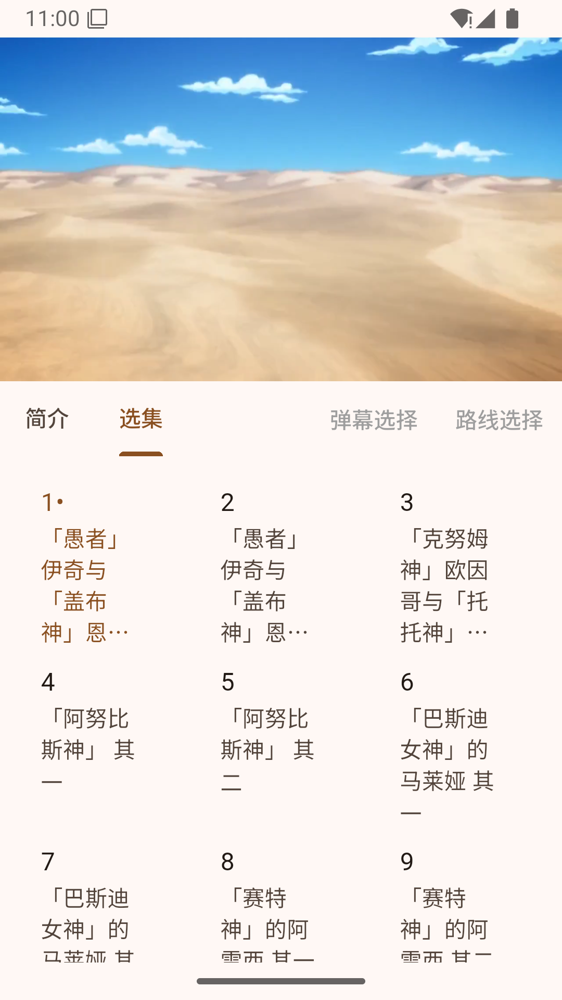
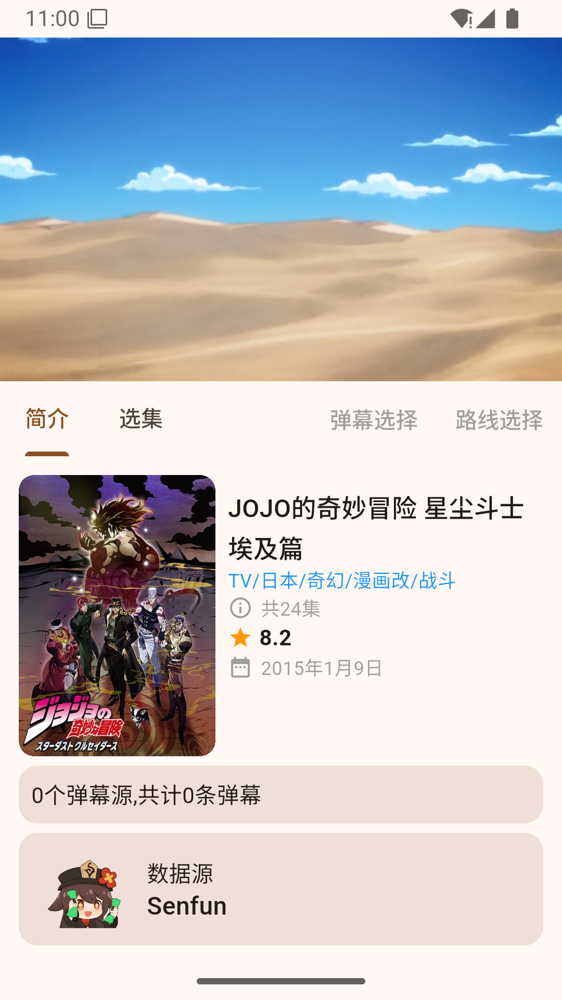
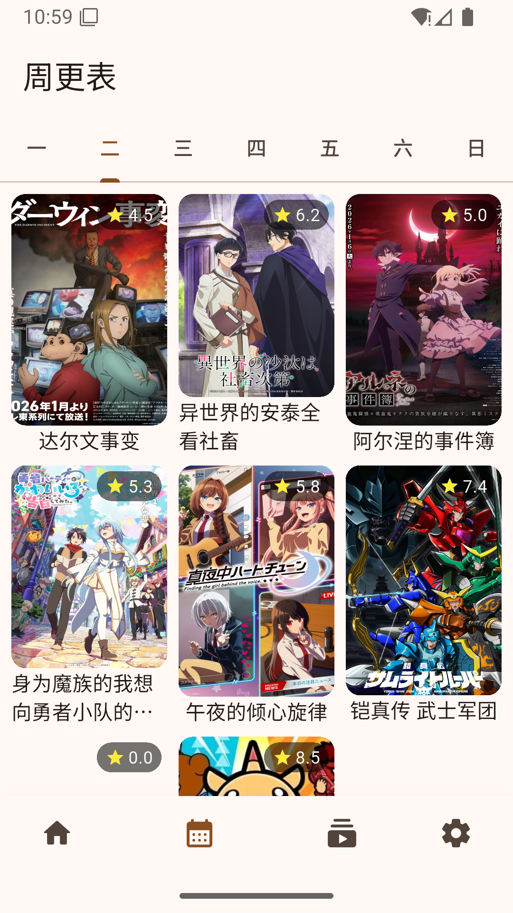
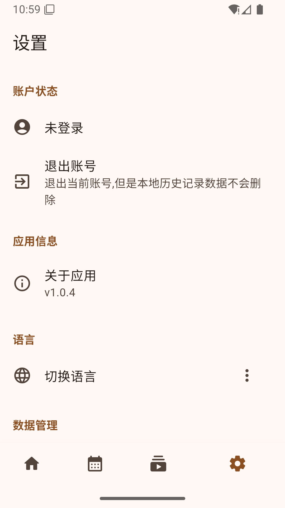
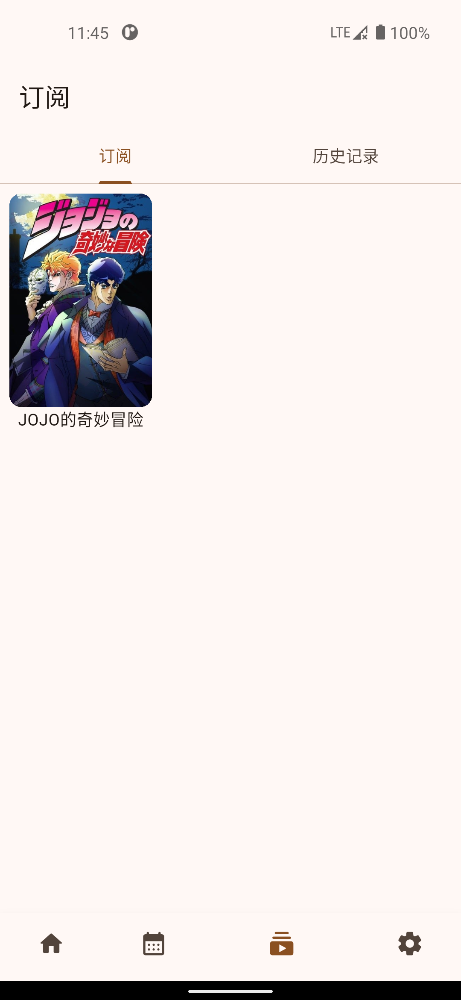

<div align="right">
  [<a href="README.md">English</a>] | [<a href="README_zh.md">简体中文</a>]
</div>

# Holo

An open-source anime streaming application built with Flutter, supporting Android and iOS platforms.

## Features

- 📺 **Anime Streaming**: Watch your favorite anime with ease
- 📅 **Calendar**: Stay updated with the latest anime releases
- 🔍 **Search**: Find anime quickly and efficiently
- 💾 **History**: Keep track of your watching progress
- 💬 **Danmaku Support**: Real-time interactive bullet chat experience
- 🌍 **Multi-language Support**: Internationalized interface supporting multiple languages
- 🌐 **Multi-platform**: Supports Windows, macOS, Android and iOS
- 🖼️ **Image Search**: Search for anime by uploading images

## App Screenshots

<div align="center">
  
  
  
</div>

<div align="center">
  
  
  
</div>

<div align="center">
  
</div>

## Acknowledgments for System Functions

- **Danmaku API Library**: [canvas_danmaku](https://github.com/huangxd-/danmu_api)
- **Anime Metainfo Provider**: [bangumi/api](https://github.com/bangumi/api)
- **Image Search Provider**: [AnimeTrace](https://ai.animedb.cn)
- **Hitokoto API**: [sekaiai.github.io](https://github.com/sekaiai/sekaiai.github.io)

## Project Structure

```
lib/
├── entity/          # Data models
├── service/         # API services and business logic
│   ├── impl/        # Service implementations
│   └── util/        # Utility functions
├── ui/              # UI components and screens
│   ├── component/   # Reusable components
│   └── screen/      # Application screens
├── util/            # Utility classes
└── main.dart        # Application entry point
```

## Getting Started

### Prerequisites

- Flutter SDK (>= 3.10.3)
- Dart SDK (>= 3.10.3)
- IDE (Android Studio, VS Code, etc.) with Flutter plugin

### Installation

1. Clone the repository

   ```bash
   git clone https://github.com/qiqd/holo.git
   cd holo
   ```

2. Install dependencies

   ```bash
   flutter pub get
   ```

3. Generate JSON serialization files

   ```bash
   flutter pub run build_runner build
   ```

4. Run the application
   ```bash
   flutter run
   ```

### Build for Production

- Android

  ```bash
  flutter build apk --dart-define=DAMMAKU_SERVER_URL=your_danmaku_server_url
  ```

- iOS
  ```bash
  flutter build ios --dart-define=DAMMAKU_SERVER_URL=your_danmaku_server_url
  ```

## Contributing

Contributions are welcome! Please feel free to submit a Pull Request.

## License

This project is licensed under the AGPL-3.0 License - see the [LICENSE](LICENSE) file for details.

```

```
